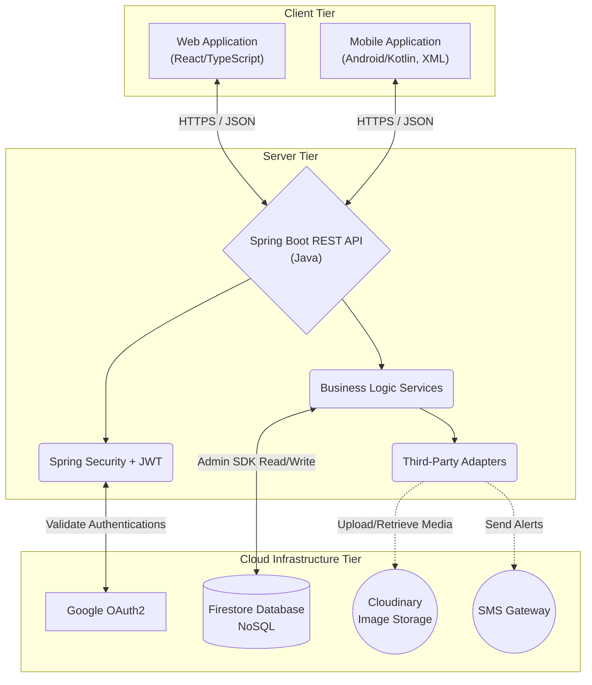

# EXECUTIVE SUMMARY 

## 1.1 Project Overview 
BarberConnect is a multi-platform barbershop management system that connects Customers, Barbers, and Admin within a centralized digital platform. The system automates appointment scheduling, haircut pricing, income distribution (80/20 split), analytics reporting, social interaction (posts, comments, reactions), and administrative monitoring. 

**The system uses:** 
*   **Database:** Firebase Firestore (NoSQL)
*   **Backend Server:** Java 17, Spring Boot 3.x, Spring Security (JWT & OAuth2)
*   **Media Storage:** Cloudinary (for profile and portfolio images)
*   **Web Application:** React 18, TypeScript, Tailwind CSS, Vite
*   **Mobile Application:** Native Android (Kotlin), XML Layouts, MVVM Architecture, Retrofit
*   **Integrations:** Third-party SMS/Notification Adapters

## 1.2 Objectives 
1. Develop a secure multi-role barber booking platform
2. Implement smart scheduling and availability management
3. Automate 80% barber / 20% owner income distribution
4. Provide analytics dashboards for barbers and admin
5. Enable social engagement features (posts, reactions, comments) via Firestore collections.

## 1.3 Scope 

**Included Features**
*   Role-based authentication (Customer, Barber, Admin) via Spring Security JWT & Google OAuth2
*   Smart appointment booking with conflict prevention
*   Haircut styles with base price and add-on styling options
*   Cash and E-Cash (GCash) payment options
*   Automatic 80/20 income computation per completed appointment
*   Feedback and rating system
*   Post, comment, and reaction social feed
*   Barber leave and availability management
*   Admin monitoring and income tracking dashboard

**Excluded Features**
*   Credit/Debit online payment gateway
*   AI haircut recommendation

---

# 1.0 INTRODUCTION 

## 1.1 Purpose 
This document defines the architecture, functional requirements, non-functional requirements, API design, database schema, and development plan for BarberConnect. It ensures that all system components are properly integrated and aligned with the **actual implementations** found in the core Java backend, Android repository, and React web codebase.

---

# 2.0 SYSTEM & APPLICATION ARCHITECTURE

## 2.1 High-Level System Architecture
The BarberConnect system relies on a **Three-Tier/Client-Server Architecture**.



## 2.2 Component Architectures

### Backend (Spring Boot Multi-Layered Architecture)
The Backend follows a strictly decoupled Multi-Layered Architecture (Controller, Service, Repository).
*   **Controllers:** Handle HTTP requests and responses (e.g., `AuthController`, `AppointmentController`).
*   **Service Layer:** Executes domain-specific business logic (e.g., income calculation, schedule validation).
*   **Repository Layer:** Interacts directly with Firestore database via Google Cloud SDK.

### Mobile Application (MVVM)
The Android app utilizes the **Model-View-ViewModel (MVVM)** pattern instead of Jetpack Compose.
*   **View:** XML Activity/Fragment layouts (like `activity_register.xml`) observing ViewModel state.
*   **ViewModel:** Stores UI-related data synchronously for the view lifecycle.
*   **Repository & RemoteDataSource:** Uses **Retrofit** to communicate with the Spring Boot backend.

### Web Application
Component-based React application utilizing Axios or standard Fetch service singletons to interact with the backend API securely with JWT bearer tokens.

---

# 3.0 FUNCTIONAL REQUIREMENTS SPECIFICATION 

## 3.1 Project Overview 
*   **Project Name:** BarberConnect 
*   **Domain:** Service Booking & Business Management 
*   **Problem Statement:** Manual scheduling and income tracking in traditional barbershops are inefficient and lack transparency. 
*   **Solution:** A centralized digital platform that automates booking, pricing, income distribution, and analytics using Firestore as the datastore layer and Spring Boot for core business logic mapping.

## 3.2 Core User Journeys 

**Journey 1: Customer Booking Flow**
1. Customer registers or logs in via Spring Security/OAuth2.
2. Browses the barber directory and filters by preference or rating.
3. Selects a barber and views available haircut styles.
4. Chooses styling add-on options with additional pricing.
5. Picks an available date and time slot.
6. Selects payment method (Cash or E-Cash/GCash).
7. Confirms booking; the backend creates a Firestore appointment document.
8. Leaves a feedback rating after the service is completed.

**Journey 2: Barber Management Flow**
1. Logs in via native Android Application.
2. Sets availability schedule or marks leave days.
3. Adds/edits haircut styles and pricing in their catalog (photos processed through Cloudinary).
4. Views upcoming scheduled customers.
5. Views income analytics dashboard.
6. Updates profile details.
*   **Income Logic:** 80% to Barber, 20% to Shop Owner. Computed server-side.

**Journey 3: Admin Monitoring Flow**
1. Admin logs in with a privileged Custom Claim/Role.
2. Sets and enforces haircut price range policies.
3. Monitors all barber schedules (Free / Booked / Leave).
4. Tracks total accumulated owner income (20% share).
5. Reviews individual barber performance metrics.

## 3.3 Feature Specifications 
*   **User Authentication:** Secured via JWT generated by Spring Boot logic post-authentication (Email/Password or OAuth2).
*   **Haircut & Service Catalog:** Images uploaded to Cloudinary, links and metadata stored in Firestore.
*   **Appointment Scheduling:** Validated strictly server-side in Spring Boot to prevent conflicts before committing to Firestore.
*   **Payment & Income Flow:** 80/20 split computation is centralized inside the Spring `AppointmentService` to ensure precision.
*   **Admin Access:** Endpoints are guarded by Spring Security `@PreAuthorize` tags targeting Admin roles.

---

# 4.0 NON-FUNCTIONAL REQUIREMENTS 

## 4.1 Performance Requirements 
*   **API response time:** ≤ 2 seconds for 95% of requests 
*   **Web page load time:** ≤ 3 seconds on standard connections 
*   **Mobile app cold start:** ≤ 3 seconds 

## 4.2 Security Requirements 
*   All network traffic to and from clients must operate over **HTTPS/TLS**.
*   Spring Security **RBAC** protects all REST endpoints via standard JWT validation.
*   Sensitive environment data (Firebase Service Account Key, Cloudinary Secrets, JWT cryptographic keys) is stored as protected system environment variables, explicitly prohibited from entering version control.

## 4.3 Compatibility Requirements 
*   **Web Browsers:** Chrome, Firefox, Safari, Edge (latest versions)
*   **Android:** API Level 24+ (Android 7.0+) 
*   **Screen Sizes:** Adaptive from Mobile (360px) to Desktop (1024px+)

---

# 5.0 API CONTRACT & COMMUNICATION 

## 5.1 API Standards 
*   **Base URL:** `https://[server_hostname]:[port]/api/v1`
*   **Format:** JSON for all requests/responses 
*   **Authentication:** Spring Security custom JWT or verified Google OAuth2 token passed as a `Bearer` token in the `Authorization` header. 
*   **Response Structure:** Custom claims (role: `CUSTOMER`, `BARBER`, `ADMIN`) are embedded in the JWT and read by Spring Security for RBAC.

**Standard Response Envelope**
```json
{ 
  "success": boolean, 
  "data": object | null, 
  "error": { 
    "code": string, 
    "message": string, 
    "details": object | null 
  }, 
  "timestamp": "ISO 8601 String" 
} 
```

## 5.2 Endpoint Specifications (Examples)

**User Registration**
*   **Description:** Creates a new user account and writes a user document to Firestore under `/users` with the assigned role. 
*   **API URL:** `/auth/register` 
*   **HTTP Method:** `POST` 
*   **Authentication:** None 
*   **Request Payload:**
```json
{  
  "email": "<email>", 
  "password": "<password>", 
  "firstname": "<firstname>", 
  "lastname": "<lastname>", 
  "role": "CUSTOMER | BARBER"  
} 
```
*   **Response Structure:**
```json
{ 
  "success": true, 
  "data": { 
    "uid": "<system_uid>", 
    "email": "...", 
    "accessToken": "<jwtToken>", 
    "refreshToken": "<refreshToken>" 
  } 
}
```

**User Login**
*   **Description:** Authenticates user via Spring Security; returns generated JWT. 
*   **API URL:** `/auth/login` 
*   **HTTP Method:** `POST` 
*   **Authentication:** None 
*   **Request Payload:**
```json
{  
  "email": "<email>", 
  "password": "<password>"  
}
```

## 5.3 Error Handling (HTTP Status Codes)
*   **200 OK:** Successful request 
*   **201 Created:** Resource successfully created 
*   **400 Bad Request:** Invalid input or missing required fields 
*   **401 Unauthorized:** JWT missing, expired, or invalid 
*   **403 Forbidden:** Insufficient permissions (Role mismatch)
*   **404 Not Found:** Resource doesn't exist 
*   **409 Conflict:** Rule violation / double booking prevention 
*   **500 Internal Server Error:** Unhandled server error 

---

# 6.0 DATABASE DESIGN (Firestore / NoSQL)

## 6.1 Entity Relationship Concept & Collections
Since BarberConnect uses a **NoSQL Database (Firestore)**, traditional relational "tables" are converted into **Root Collections** and **Sub-collections** or Document References.

**Detailed Relationships (Document References):**
*   **One-to-One Concept:** `users` ↔ `barber_profiles` (Each barber user has an associated profile document linking back via `user_id`).
*   **One-to-Many Concept:** `users` → `appointments` (Customers query appointments via the `customer_id` field).
*   **One-to-Many Concept:** `barber_profiles` → `haircut_styles` (Haircuts queried via `barber_id`).
*   **Many-to-One Concept:** `appointments` → `barber_profiles` (`barber_id` reference).

## 6.2 Key Collections & Document Structures

1.  **`users` Collection**
    *   **Purpose:** Stores essential profile details and roles.
    *   **Fields:** `uid`, `email`, `password_hash` (handled by Spring Security if email/pass), `role` (`CUSTOMER`, `BARBER`, `ADMIN`).

2.  **`barber_profiles` Collection**
    *   **Purpose:** Holds barber-specific operational details.
    *   **Fields:** `user_id` (reference), `gcash_number`, `monthly_income`, `leave_days` (Array).

3.  **`haircut_styles` Collection**
    *   **Purpose:** Catalog of haircut styles per barber.
    *   **Fields:** `id`, `barber_id`, `name`, `base_price`, `image_url` (Cloudinary Reference), `style_options` (Array of Map objects containing option names and extra prices).

4.  **`appointments` Collection**
    *   **Purpose:** Core transactional document mapping the booking.
    *   **Fields:** `id`, `customer_id`, `barber_id`, `total_price`, `payment_method` (`CASH` | `GCASH`), `status` (`PENDING` | `COMPLETED` | `CANCELLED`), `timestamp`.

5.  **`feedback` Collection**
    *   **Purpose:** Customer rating and comments.
    *   **Fields:** `id`, `appointment_id`, `customer_id`, `barber_id`, `rating`, `comment`.

6.  **`income_records` Collection**
    *   **Purpose:** Tracks income distribution on computed appointments.
    *   **Fields:** `id`, `barber_id`, `appointment_id`, `barber_share` (80%), `owner_share` (20%), `date_recorded`.

7.  **`admin_settings` Collection**
    *   **Purpose:** Stores system-wide policies.
    *   **Fields:** `pricing_rules`, `monitoring_preferences`.
